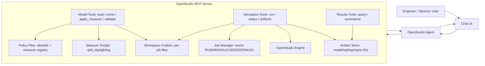
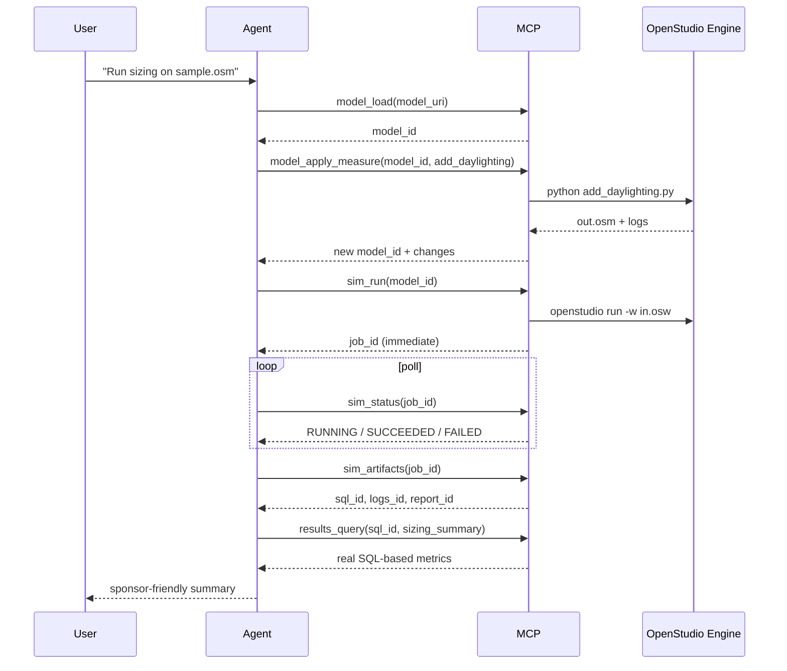

# OpenStudio AI Architecture Diagram (Sponsor View)

This diagram shows how a user request flows through OpenStudio AI.

## 1) Big Picture

## 2) Typical Sizing Workflow

## 3) Plain-English Summary

- The **agent** is the coordinator.
- The **MCP server** is the toolbox.
- The **OpenStudio engine** does heavy simulation work.
- **Job manager** tracks progress.
- **Artifact store** keeps references to outputs.
- **Policy files** control what tools/measures are allowed.
