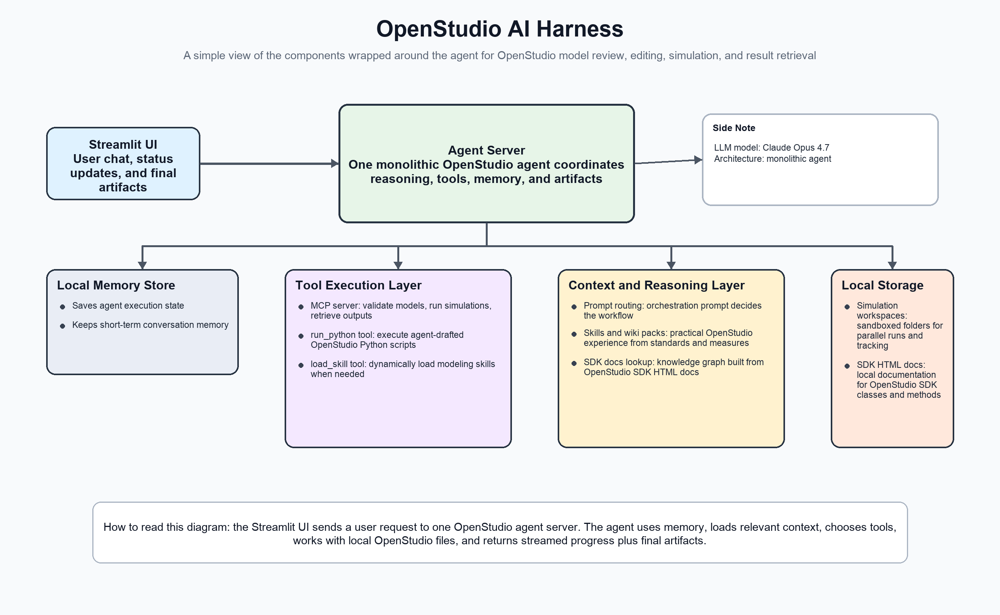

# OpenStudio AI Harness

OpenStudio AI Harness is a deployable AI-agent harness for building-energy
modeling with OpenStudio. It pairs a local, deterministic MCP runtime with
agent-facing skills, reviewed knowledge, and host adapters for Codex, Claude
Code, and future AI assistant environments.



## The problem

OpenStudio modeling, HVAC configuration, simulation, and results analysis are
specialized, multi-step tasks. A general-purpose AI assistant does not by
itself have reliable procedures for using the OpenStudio SDK, preserving
assumptions across a long workflow, validating model changes, or running a
simulation and interpreting the resulting artifacts.

Energy modelers also need an approach that works in their preferred AI host
without maintaining a separate, divergent implementation for every host or
requiring users to understand Python environments, MCP servers, and command
paths before they can begin.

## What this repository provides

This repository is the source of truth for OpenStudio AI. It contains three
connected layers:

1. **MCP runtime:** controlled tools for model lifecycle operations, approved
   measures, asynchronous simulation, SQL-backed results, SDK documentation
   lookup, and local workflow state.
2. **Trusted agent harness:** reviewed skills, prompts, knowledge packs,
   policies, and workflow-state contracts that guide an AI assistant through
   OpenStudio tasks.
3. **Host adapters:** exporters that package the shared harness into native
   Claude Code and Codex plugins, including portable MCP configuration and
   marketplace setup guidance.

The runtime executes engineering operations; the plugin tells the AI assistant
which workflow to follow and which runtime tools to use. Generated plugin
exports are release artifacts—update the source assets in this repository and
regenerate exports rather than editing generated plugin files directly.

For the detailed design, see the [architecture overview](HARNESS_DETAILS.md),
[packaging roadmap](PACKAGING_NORTHSTAR.md), and
[runtime installation contract](RUNTIME_INSTALLATION_CONTRACT.md).

## How to use OpenStudio AI

### Install the runtime

The published runtime is intended for users of Codex, Claude Code, and other
supported hosts:

```bash
python -m pip install openstudio-ai
openstudio-ai install-runtime
openstudio-ai doctor
```

Real model editing and simulation additionally require the native OpenStudio
application or CLI. Make it available on `PATH`, or set `OPENSTUDIO_PATH` to a
specific executable.

### Export a plugin

From a source checkout, export a marketplace-oriented plugin package:

```bash
openstudio-ai export codex \
  --output-dir /tmp/openstudio-ai-codex-plugin \
  --runtime-mode marketplace
```

For local development, use `--runtime-mode local`; this export references the
active source environment and should not be distributed to other machines.
See the [marketplace install guide](MARKETPLACE_INSTALL_GUIDE.md) for the
modeler-facing setup flow and the [runtime-mode contract](RUNTIME_INSTALLATION_CONTRACT.md#adapter-runtime-modes)
for the distinction between local, installed, and marketplace exports.

### Enable Codex project routing

After installing the Codex plugin, add the managed OpenStudio workflow policy
to the project where natural-language OpenStudio requests should be routed:

```bash
openstudio-ai install codex --target-dir /path/to/codex-project
```

Use `--dry-run` before `--force` when the target already has an unmanaged
`AGENTS.md`; the command preserves unrelated project instructions.

## Developer quick start

Use Python 3.12 or newer. From the repository root:

```bash
python -m venv .venv
. .venv/bin/activate
python -m pip install --upgrade pip
python -m pip install -e ".[dev,standalone]"
```

Run focused checks for the runtime and plugin exporters:

```bash
.venv/bin/python -m pytest -q \
  tests/test_harness_asset_manifest.py \
  tests/test_openstudio_cli.py \
  tests/test_openstudio_claude_code_adapter.py \
  tests/test_openstudio_codex_adapter.py
```

Export both marketplace packages for a local release-artifact check:

```bash
openstudio-ai export marketplace \
  --output-dir /tmp/openstudio-ai-plugins \
  --runtime-mode marketplace \
  --force
```

The OpenStudio-gated simulation tests require a native OpenStudio CLI:

```bash
OPENSTUDIO_PATH=/path/to/openstudio \
  .venv/bin/python -m pytest -q tests/test_mcp_openstudio_smoke.py
```

## Where to start contributing

| If you are changing… | Start here |
| --- | --- |
| MCP tools or runtime behavior | `openstudio_mcp/` and [Harness Details](HARNESS_DETAILS.md) |
| Skills, prompts, or reviewed knowledge | `skills/`, `prompts/`, and `knowledge/` |
| Plugin package layout or export logic | `adapters/` and `harness/asset_manifest.yaml` |
| Long-running workflow state | `blackboard/` and `openstudio_mcp/runtime/` |
| Candidate learning or promotion | `learning/`, `evals/`, and `policy/` |

Read the [Developer Guide](DEVELOPER_GUIDANCE.md) before changing boundaries or
adding assets. It defines ownership, export behavior, review/promotion rules,
and the focused validation expected for each type of change.

## Further documentation

- [Advanced User Guide](ADVANCED_USER_GUIDE.md)
- [Marketplace Install Guide](MARKETPLACE_INSTALL_GUIDE.md)
- [Runtime Installation Contract](RUNTIME_INSTALLATION_CONTRACT.md)
- [Developer Guide](DEVELOPER_GUIDANCE.md)
- [Release Guide](RELEASE.md)
- [Architecture diagram](architecture_diagram.md)
